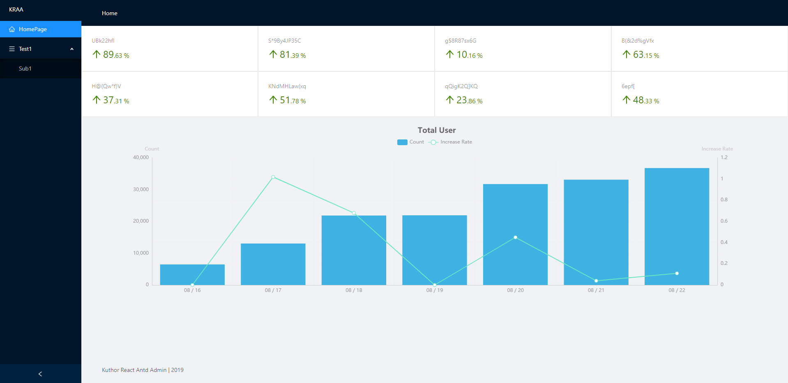

# Kuthor React Antd Admin

## What's this

This is the simplest framework to build a admin frontend website using [React](https://github.com/facebook/react) and [Antd](https://github.com/ant-design/ant-design).

## Quick Start

Just use 2 terminal: 1 for mock backend, 1 for react frontend

```
npm install
npm run mock
npm start
```

## Feature

- **Base** with *React*
- **UI&UX** with *Antd*
- **State Manage** with *[React-Redux](https://www.npmjs.com/package/react-redux)*
- **Dynamic load** with *[React-Router-Dom](https://www.npmjs.com/package/react-router-dom)*

That's it, no other complex things, just simpler than you image.

## Sample


